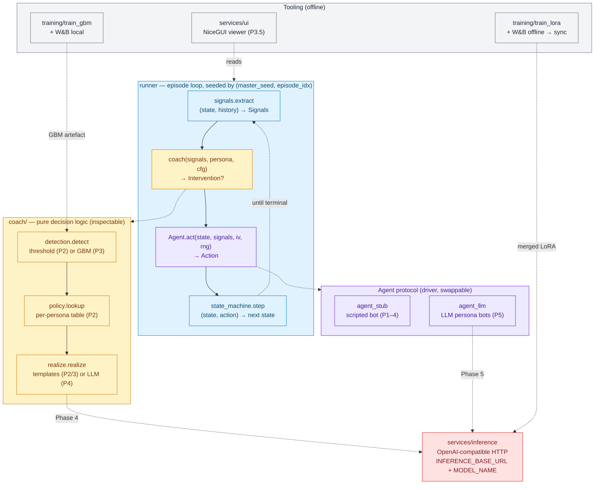

# Architecture

The architecture exists to keep one promise from the [Introduction](./intro.md):
**decision logic stays in inspectable code; the model only produces behavior and
words.** Everything below is organized around the *swap boundaries* that let a
later build phase replace one component without disturbing its neighbours.

## The per-episode data path

`runner` drives a seeded episode loop. After each step it recomputes `Signals`
from the action history, asks the `coach` whether to intervene, lets the `Agent`
act, and advances the state machine. The data path — **Signals → coach → Action
→ state machine** — never changes; only what sits *behind* each box does.



Reading the diagram against the core promise:

- **Blue** boxes are the unchanging measurement substrate.
- **Yellow** boxes are the coach's decision logic in plain code — the rubric's
  "traceable decision rules."
- **Purple / red** boxes sit behind a swap boundary (`Agent.act` signature,
  `INFERENCE_BASE_URL`). Those boundaries are the *only* places a phase upgrade
  touches.

## Frozen interfaces

These signatures are **frozen** — a phase may reimplement anything *behind* an
interface, but may not change the interface itself without surfacing the change
first. They are what make any phase a clean rewind.

### `Action` — the universal driver output

Every agent (scripted stub now, LLM bots later) emits this. It is the seam that
lets you swap drivers without touching anything downstream.

```python
from dataclasses import dataclass
from typing import Literal, Optional

@dataclass
class Action:
    type: Literal["continue", "back", "select", "hover",
                  "change_field", "open_tab", "abandon"]
    target: Optional[str] = None   # tariff/element/field, or branch choice
    dwell_s: float = 0.0           # seconds on the current screen BEFORE this action
```

`dwell_s` riding on every action is how dwell/inactivity signals are computed
without a separate clock. `back` / `hover` / `change_field` / `open_tab` do not
advance the step — they are signal-generating.

### `Signals` — the feature vector

Recomputed from action history after each step. Consumed by `detect()` (both the
threshold and GBM implementations) and by `policy`.

```python
@dataclass
class Signals:
    # progress / time
    step: int
    max_steps_completed: int
    dwell_current_s: float
    dwell_total_s: float
    time_since_last_action_s: float
    # navigation / friction
    back_nav_count: int
    back_from_step: Optional[int]
    field_change_count: int
    # S4-specific (price table)
    tariff_hover_count: int
    advisory_tariff_clicked: bool   # the "advisory-only wall"
    tariff_selected: Optional[str]
    external_tab_opens: int         # comparison-tab behaviour
    # S7-specific (final price)
    price_gap_eur: float            # final - provisional (synthetic; see Phase 1/§4)
    hover_cancel_count: int
```

### `coach` and `Agent` contracts

```python
# coach/__init__.py
def coach(signals: Signals, persona: str, policy) -> Optional["Intervention"]:
    """Decide whether to intervene and, if so, with what. Pure decision logic.
       Phase 1: stub. Phase 2: threshold + policy. Phase 3: GBM + policy."""

# agent.py
class Agent(Protocol):
    def act(self, state, signals: Signals, intervention, rng) -> Action:
        """Produce the next action. The ONLY place stochastic drop-off lives.
           An intervention may lower this step's drop-off probability or swap a branch."""
```

`Intervention` carries at least `{type, persona, step, text}`. `text` is empty
until `realize()` fills it (templates in Phase 2, LLM in Phase 4).

## The state machine

The in-scope path skips Step 5 deliberately (an out-of-scope add-on step), so the
states jump S4 → S6.

```python
class Step(Enum):
    START=0; S1_COVERAGE_TYPE=1; S2_FOR_WHOM=2; S3_PERSONAL_DATA=3
    S4_INITIAL_PRICE=4; S6_HEALTH_QS=6; S7_FINAL_PRICE=7; S12_CLOSING=12
    CONVERTED=90; ABANDONED=91; ROUTED_ADVISOR=92
```

```
S1: "doctor" + continue → S2 ;  "hospital"|"both" → ROUTED_ADVISOR
S2: "myself" + continue → S3 ;  "others"          → ROUTED_ADVISOR
S3: continue → S4
S4: "Start"|"Optimal" + continue → S6 ;  "OptPlus"|"Premium" → ROUTED_ADVISOR
S6: continue → S7
S7: continue → S12
S12: continue → CONVERTED
any non-terminal: abandon → ABANDONED ; back → previous in-scope step
```

## Service topology

Three services, decomposed along the frozen seams (not finer), orchestrated by
`docker-compose.yml`:

| Service | Role | Notes |
|---|---|---|
| **`inference`** | OpenAI-compatible model server | **This container is the swap boundary.** Swapping models means swapping what this service runs — not editing any other code. |
| **`coach`** | the simulation engine | state machine, signals, detection, policy, realize, runner. Talks to `inference` over HTTP only. |
| **`ui`** | NiceGUI viewer (Phase 3.5) | opens a dialog whenever `coach()` fires; consumes the coach in-process. |

The rules that keep this from sprawling:

- The coach reaches the model **only over HTTP**, via `INFERENCE_BASE_URL` +
  `MODEL_NAME`. Model swaps touch env + the inference image, never coach code.
- **Do not over-decompose.** The GBM is a loaded object *inside* the coach
  service, not its own service. The state machine is a library, not a service.
- Define the compose topology early, fill services as phases land. The
  `inference` service only becomes load-bearing at Phase 4.

See [Running locally](./running-locally.md) for the model-swap mechanism in
practice.
